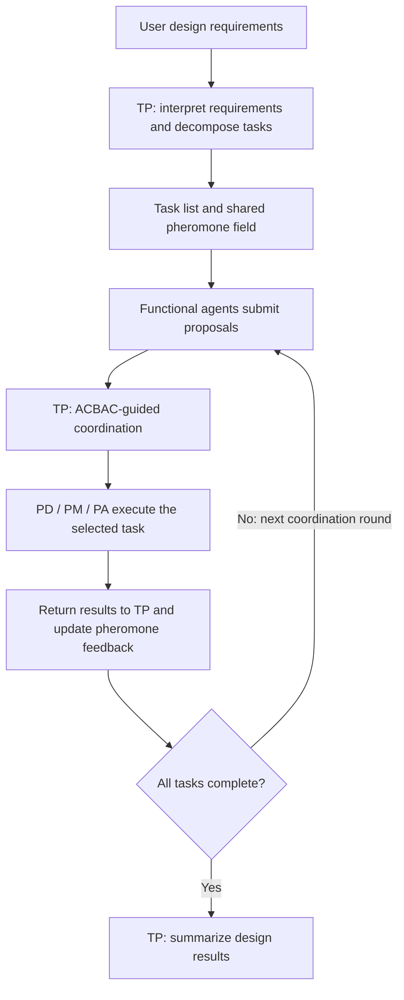

# IGD

**Intelligent Generative Design for mechanical products**

Public coordination runtime accompanying *Intelligent Generative Design Framework for Semantic Driven Mechanical Design*.

IGD connects task planning (TP), part design (PD), part modelling (PM), and part assembly (PA) through an ACBAC shared pheromone field. TP interprets the initial requirement and remains involved in dispatch, returned results and final synthesis throughout execution.

[中文说明](README.zh-CN.md) · [Architecture](docs/architecture.md) · [Dify integration](docs/dify.md) · [Contracts](docs/contracts.md)

## Architecture



The initial decomposition and subsequent coordination are responsibilities of the same TP agent. The public runtime calculates proposal strengths, aggregates the field, selects a dispatch and validates TP decisions. The TP workflow receives the current state before each dispatch and receives the final task result before summarizing the run. A TP decision can dispatch the selected task, abort, or finish after every task has succeeded.

Specialized design, CRP/CGP modelling, Checker refinement, MKG retrieval, and GART assembly are accessed through private Dify workflows. Their definitions, prompts, knowledge assets and model weights are maintained separately and are not distributed in this repository.

## Local shaft example

Python 3.11 or later is required. The coordination runtime has no third-party dependencies.

```console
python -m pip install -e .
igd demo
```

Or run directly from a source checkout:

```console
python tools/run_igd.py demo
```

The example builds a four-segment stepped shaft with two keyways:


| Feature | Default |
| --- | --- |
| Four shaft diameters | 60, 70, 60, 55 mm |
| Four segment lengths | 16.95, 96, 69.45, 51.35 mm |
| Overall shaft length | 233.75 mm |
| Segment 2 keyway: length / width / depth | 22 / 14 / 6 mm |
| Segment 2 keyway: margin from segment end | 36 mm |
| Segment 4 keyway: length / width / depth | 34 / 10 / 5 mm |
| Segment 4 keyway: margin from shaft end | 5 mm |
| Segment 4 keyway: clearance from shoulder | 12.35 mm |

Axial coordinates start at zero, and segment lengths are actual contiguous lengths. Both keyways open toward +Y and remain fully within their assigned segments. In the parameter file, `keyways[].segment` counts segments from 1 to 4, and `end_margin_mm` measures from the positive-Z end of that segment.

[shaft.py](examples/shaft.py) is a standalone CadQuery version of the default geometry; CAD viewers can display its `result` object.

The local TP policy decomposes the example into PD dimension validation and PM modelling. It coordinates both tasks and then summarizes their results: initial TP planning, TP dispatch, PD response, TP dispatch, PM response, TP completion. PA is used when a task plan includes multiple parts to assemble.

This example uses a deterministic local backend, identified as `demo`, and needs no API credentials. To change dimensions:

```console
igd demo --parameters examples/shaft_parameters.json
```

Each invocation creates a fresh directory:

```text
outputs/run-<timestamp>-<id>/
├── run.json
└── artifacts/
    ├── design.json
    ├── shaft.json
    └── shaft.py
```

The Python artifact is standalone CadQuery source assigning the final object to `result`. The run report includes task results, proposal decisions, pheromone values, every TP coordination round, the final TP summary and available token usage.

To also export the example geometry to STEP, install the optional CAD dependency and run the supplied exporter:

```console
python -m pip install -e ".[cad]"
python examples/export_demo.py
```

It writes `shaft.step` and `geometry-checks.json` to `outputs/demo-cad/`, checking solid validity, dimensions, both keyways and the STEP round trip. The exporter runs the shipped example builder; the coordination runtime stores workflow-generated Python without executing it.

## Connect private workflows

Copy `.env.example` to `.env` and configure the TP workflow and relevant functional workflows according to [Dify integration](docs/dify.md).

The main entry point starts with a design requirement:

```console
igd run --requirement "Design a four-segment stepped shaft with two keyways." --env-file .env
```

TP first returns a task list. The runtime then invokes TP again on every coordination round, carrying task states, validated results, proposal scores and the updated field. The final round requests completion after all tasks have succeeded.

### What is the JSON task plan?

[shaft_plan.json](examples/shaft_plan.json) is a saved initial task list. It records each task's ID, role, description, inputs and dependencies. A plan can be generated by TP or loaded from a file.

**JSON task plan → structural validation → executable task graph.**

“Validated task graph” describes the in-memory representation after checking task IDs, roles, dependency references and cycles. It is not another agent, and graph validation does not establish engineering or geometric correctness.

To inspect or start from the supplied plan:

```console
igd validate-plan examples/shaft_plan.json
igd run --plan examples/shaft_plan.json --env-file .env
```

A saved plan supplies the initial decomposition. TP still coordinates execution and summarizes results, so `--plan` also requires a TP API key. The shaft plan uses TP, PD and PM; PA is required for plans containing assembly tasks.

Only explicitly selected environment files are read. Shell variables take precedence. Exit codes: `0` for completed runs, `1` for execution or coordination failure, and `2` for configuration, initial planning, input or output-storage errors. Failed predecessors block descendants; TP can continue independent branches. TP errors or an abort cancel pending work. The `--max-rounds` limit defaults to 1001.

## ACBAC configuration

The field implements the paper's proposal strength and feedback equations:

```text
phi_j = alpha * Confidence + beta * History + gamma * Plan
      + delta * Capability + epsilon * Time

tau_i(next) = (1 - rho) * tau_i + Q * quality_i
```

Runtime defaults use equal weights, `rho = 0.2`, `Q = 1.0` and `tau_0 = 1.0`. These are explicit reference configuration choices. The field samples a ready task and an eligible executor from the aggregated concentrations and proposal strengths; TP coordinates that dispatch without adding another proposal-scoring formula. See [Architecture](docs/architecture.md) for normalization, history and state semantics.

```console
igd demo --seed 7 --scheduler-config examples/acbac_config.json
```

## Model fine-tuning

The [LLaMA-Factory configuration](training/llamafactory/qwen2_5coder_lora_s1_sft.yaml) provides the Qwen2.5-Coder-7B-Instruct LoRA SFT recipe. It continues training an existing adapter with rank 32, alpha 64 and a learning rate of 1e-5.

Prepare the training environment, dataset and adapter as described in the [fine-tuning guide](training/llamafactory/README.md), then run from the repository root:

```console
llamafactory-cli train training/llamafactory/qwen2_5coder_lora_s1_sft.yaml
```

The configuration and dataset registration example are distributed here; model weights, adapter checkpoints and training data are supplied separately.

## Development

```console
python tools/run_tests.py
python -m pip install build
python -m build
python tools/package_release.py
```

Tests cover ACBAC arithmetic, task dependencies, TP round trips, terminal decisions, Dify HTTP behavior and CLI execution using a local HTTP fixture. Installing the `cad` extra enables solid and STEP checks. CI runs the core suite on Linux and Windows and the geometry example on Linux.

The release packager selects public files explicitly and produces a source ZIP and SHA-256 digest in `dist/`.

## Repository layout

```text
src/igd/
    acbac.py          Proposal evaluation and shared pheromone field
    agents.py         Functional agents
    coordination.py   TP decisions and local coordination policy
    engine.py         TP execution loop and task state
    geometry.py       Parameterized shaft builder and geometry checks
    models.py         Task and result contracts
    backends/         Local example and Dify adapters
    artifacts.py      Run reports and source artifacts
    cli.py            Command-line interface
docs/                 Architecture and integration guide
schemas/              Public JSON contracts
examples/             Shaft source, plan, parameters and CAD export
training/llamafactory/ LoRA SFT configuration and dataset registration example
tests/                Unit, integration and geometric tests
tools/                Source runners and release packaging
```

## License

The public code uses the [MIT License](LICENSE). Private workflows and associated assets are outside this distribution.
