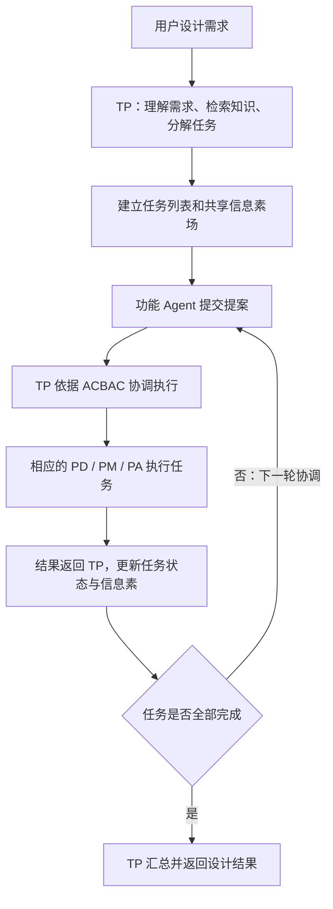
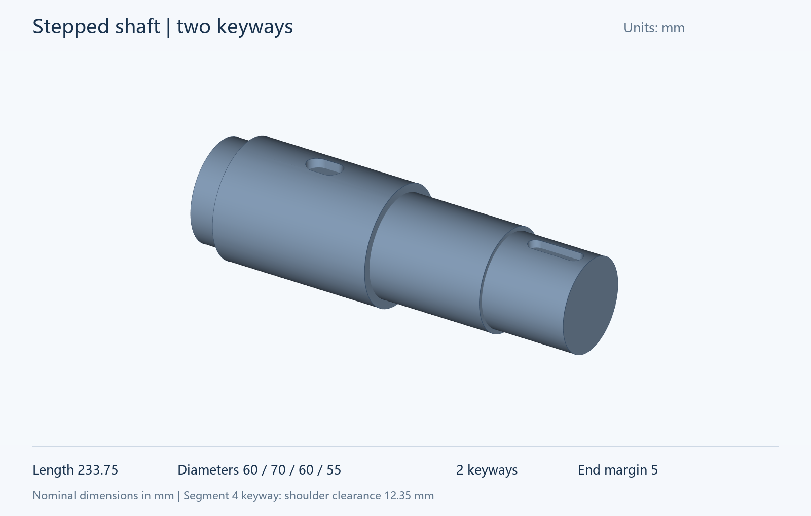

# IGD

配套论文：*Intelligent Generative Design Framework for Semantic Driven Mechanical Design*。

本仓库提供 TP 任务规划与持续协调、PD 零件设计、PM 零件建模、PA 零件装配、ACBAC 提案评价与信息素反馈，以及任务状态管理和 CadQuery 源码导出。

[English README](README.md) · [架构说明](docs/architecture.md) · [Dify 接口](docs/dify.md) · [数据契约](docs/contracts.md)

## 运行流程



初始任务分解和后续协调属于同一个 TP 的职责。公开运行框架计算提案强度、聚合信息素并选出任务及执行者；每轮 TP 接收当前状态、已有结果和该选择，决定派发、终止或汇总完成。任务尚未全部成功时，系统拒绝提前完成的决定。

专业设计、CRP/CGP 建模、Checker 迭代、MKG 检索和 GART 装配通过私有 Dify 工作流接入。其内部提示词、工作流定义、知识资产和模型权重不随本仓库发布。

## 阶梯轴示例

需要 Python 3.11 或更高版本。协作框架本身没有第三方运行依赖。

```console
python -m pip install -e .
igd demo
```

也可直接从源码运行：

```console
python tools/run_igd.py demo
```

默认几何为一根四段阶梯轴，第二段和第四段各有一处键槽：



| 参数 | 默认值 |
| --- | --- |
| 四段轴直径 | 60、70、60、55 mm |
| 四段实际轴长 | 16.95、96、69.45、51.35 mm |
| 总轴长 | 233.75 mm |
| 第二段键槽长 / 宽 / 深 | 22 / 14 / 6 mm |
| 第二段键槽距该段末端 | 36 mm |
| 第四段键槽长 / 宽 / 深 | 34 / 10 / 5 mm |
| 第四段键槽距轴端 | 5 mm |
| 第四段键槽距轴肩 | 12.35 mm |

轴向坐标从零开始，四段按实际长度连续连接。两处键槽均朝向 +Y，完整位于各自轴段内。参数中的 `keyways[].segment` 为从 1 到 4 的轴段编号，`end_margin_mm` 为键槽距所在轴段正 Z 方向末端的距离。

[shaft.py](examples/shaft.py) 提供默认几何的独立 CadQuery 源码，可在 CAD 查看器中显示其 `result` 对象。

本地 TP 按示例规则生成 PD 和 PM 任务，并持续参与派发、接收结果及最终汇总。一次正常运行包含一次初始规划和三次协调调用。该示例为单个零件；多零件任务按计划启用 PA。

本地后端标记为 `demo`，无需 API Key。修改尺寸可使用：

```console
igd demo --parameters examples/shaft_parameters.json
```

每次运行会新建 `outputs/run-.../`，包含 `run.json`、设计参数、阶梯轴结果和 `shaft.py`。运行报告保存每轮 TP 决定、任务结果、提案、信息素、耗时和已知 token 用量。

需要导出示例的 STEP 几何文件时，安装可选 CAD 依赖并运行随附的导出程序：

```console
python -m pip install -e ".[cad]"
python examples/export_demo.py
```

结果位于 `outputs/demo-cad/`，包括 `shaft.step` 和 `geometry-checks.json`，检查实体有效性、尺寸、两处键槽及 STEP 回读。导出程序使用仓库内置的示例构造函数；运行框架保存工作流生成的 Python 源码，不自动执行。

## Dify 接入

复制 `.env.example` 为 `.env`，填写 TP 及所需功能角色的 Workflow API Key，按[接口说明](docs/dify.md)配置输入输出。

主入口从设计需求开始：

```console
igd run --requirement "设计一根带两处键槽的四段阶梯轴。" --env-file .env
```

TP 先完成初始任务分解；随后每轮再次被调用，接收任务状态、完整的已验证结果、提案和信息素。最后一次协调接收最终建模结果，并返回完成摘要。

### JSON task plan 是什么？

[shaft_plan.json](examples/shaft_plan.json) 是保存下来的初始任务列表，描述任务编号、角色、输入和依赖关系。它与任务图的关系是：

**JSON 任务计划 → 检查编号、角色、依赖和环路 → 内存中的可执行任务图。**

“Validated task graph”表示任务结构已经通过校验，不是独立 Agent，也不表示设计或几何已经正确。

```console
igd validate-plan examples/shaft_plan.json
igd run --plan examples/shaft_plan.json --env-file .env
```

文件入口只提供初始任务分解，后续 TP 协调仍会执行，因此也需要 TP Key。阶梯轴计划使用 TP、PD、PM；含装配任务的计划另需 PA Key。

返回码：`0` 为成功完成，`1` 为任务执行或协调失败，`2` 为配置、初始规划或文件读写错误。失败任务阻塞其后继，独立任务可以继续；TP 中断会取消尚未执行的任务。`--max-rounds` 默认限制为 1001 轮。

## 模型微调

仓库提供 [LLaMA-Factory 微调配置](training/llamafactory/qwen2_5coder_lora_s1_sft.yaml)，用于 Qwen2.5-Coder-7B-Instruct 的 LoRA SFT。该配置从已有 adapter 继续训练，LoRA rank 为 32、alpha 为 64、学习率为 1e-5。

按[微调说明](training/llamafactory/README.md)准备训练环境、数据集与 adapter 后，在仓库根目录执行：

```console
llamafactory-cli train training/llamafactory/qwen2_5coder_lora_s1_sft.yaml
```

仓库包含训练配置和数据集注册示例，模型权重、adapter 检查点和训练数据单独提供。配置中的相对路径均以执行命令时的仓库根目录为基准。

## 配置与开发

```console
igd demo --seed 7 --scheduler-config examples/acbac_config.json
python tools/run_tests.py
python tools/package_release.py
```

ACBAC 权重、初始信息素、蒸发率和反馈系数可配置。[架构说明](docs/architecture.md)给出公式、参考策略和 TP 生命周期。测试覆盖多轮协调、结果传递、失败处理及 HTTP 接口；安装 CAD 扩展后还会运行实体检查。

源码打包工具只收录指定的公开文件，不包含环境文件、运行输出、缓存或私有目录。公开代码采用 [MIT 许可证](LICENSE)。
